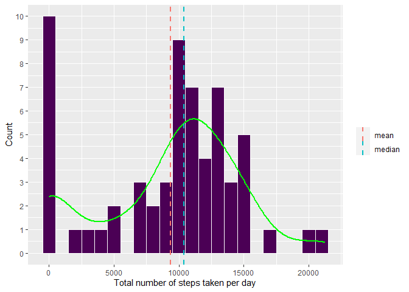
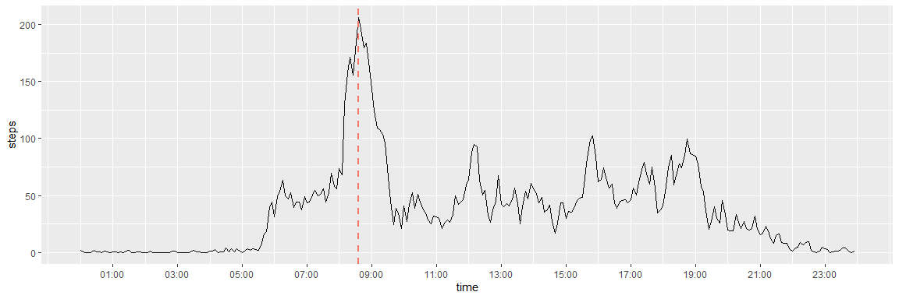
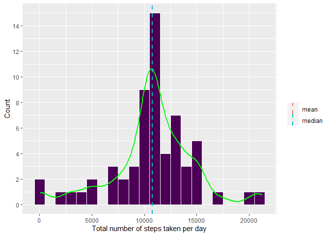
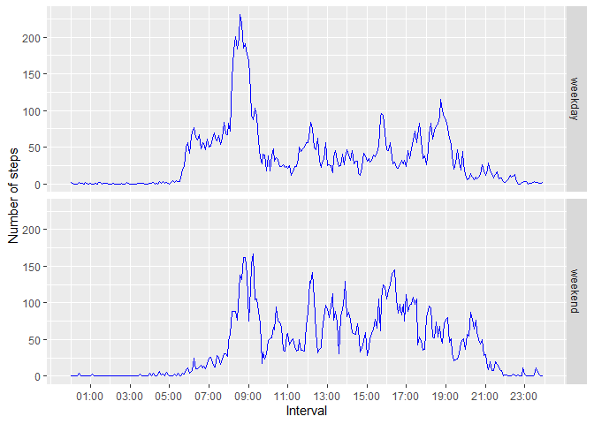

## Loading and preprocessing the data


```r
if (!file.exists('activity.csv'))
{
    unzip(zipfile = 'activity.zip')
}
activity <- fread('activity.csv')
str(activity)
```

```
## Classes 'data.table' and 'data.frame':	17568 obs. of  3 variables:
##  $ steps   : int  NA NA NA NA NA NA NA NA NA NA ...
##  $ date    : IDate, format: "2012-10-01" "2012-10-01" ...
##  $ interval: int  0 5 10 15 20 25 30 35 40 45 ...
##  - attr(*, ".internal.selfref")=<externalptr>
```

## What is mean total number of steps taken per day?


```r
## The total number of steps taken each day
activity.date <- activity %>%
    group_by(date) %>%
    summarise(steps = sum(steps, na.rm = TRUE), .groups = 'drop')

## Make the plot
ggplot(data = activity.date, mapping = aes(x = steps)) +
    geom_histogram(colour = 'white', fill = '#4B0055', binwidth = 1000) +
    geom_density(aes(y = 1000 * ..count..), color = 'green', lwd = 1) +
    scale_y_continuous(n.breaks = 10) +
    geom_vline(aes(xintercept = mean(steps), color = 'mean'), lty = 'dashed', lwd = 1) +
    geom_vline(aes(xintercept = median(steps), color = 'median'), lty = 'dashed', lwd = 1) +
    labs(x = 'Total number of steps taken per day', y = 'Count', color = '')
```

<!-- -->


```r
summary(activity.date$steps)
```

```
##    Min. 1st Qu.  Median    Mean 3rd Qu.    Max. 
##       0    6778   10395    9354   12811   21194
```

## What is the average daily activity pattern?

Make a time series plot (i.e. `type = "l"`) of the 5-minute interval (x-axis) and the average number of steps taken, averaged across all days (y-axis)


```r
## The average number of steps taken, averaged across all days
activity.interval <- activity %>%
    group_by(interval) %>%
    summarise(steps = mean(steps, na.rm = TRUE), .groups = 'drop') %>%
    mutate(time = (floor(interval / 100) * 60 + interval %% 100) * 60)

## The interval of maximum steps number
peak <- which.max(activity.interval$steps)
peak_time <- activity.interval$time[peak]

## Make the plot
ggplot(data = activity.interval, mapping = aes(x = time, y = steps)) +
    geom_line() +
    geom_vline(aes(xintercept = peak_time, color = 'red'), linetype = 'dashed', size = 1) +
    scale_x_time(labels = scales::time_format('%H:%M'), breaks = minutes(60 * seq(from = 1, to = 23, by = 2))) +
    theme(legend.position = 'none')
```

<!-- -->

Which 5-minute interval, on average across all the days in the dataset, contains the maximum number of steps?


```r
activity.interval$interval[peak]
```

```
## [1] 835
```

So the interval from 08:35 to 08:40 contains the maximum number of steps on average across all the days in the dataset.

## Imputing missing values

Calculate and report the total number of missing values in the dataset (i.e. the total number of rows with `NA`)


```r
sum(is.na(activity$steps))
```

```
## [1] 2304
```

Devise a strategy for filling in all of the missing values in the dataset.


```r
## The strategy is to set the mean for that 5-minute interval.
x <- activity %>% left_join(activity.interval, by = 'interval')
x.steps <- coalesce(x$steps.x, x$steps.y)
sum(is.na(x.steps))
```

```
## [1] 0
```

Create a new dataset that is equal to the original dataset but with the missing data filled in.


```r
activity.new <- activity %>%
    select(date, interval) %>%
    mutate(steps = x.steps)
```

Make a histogram of the total number of steps taken each day and Calculate and report the `mean` and `median` total number of steps taken per day. Do these values differ from the estimates from the first part of the assignment? What is the impact of imputing missing data on the estimates of the total daily number of steps?


```r
## The total number of steps taken each day
activity.new.date <- activity.new %>%
    group_by(date) %>%
    summarise(steps = sum(steps, na.rm = TRUE), .groups = 'drop')

## Make the plot
ggplot(data = activity.new.date, mapping = aes(x = steps)) +
    geom_histogram(colour = 'white', fill = '#4B0055', binwidth = 1000) +
    geom_density(aes(y = 1000 * ..count..), color = 'green', lwd = 1) +
    scale_y_continuous(n.breaks = 10) +
    geom_vline(aes(xintercept = mean(steps), color = 'mean'), lty = 'dashed', lwd = 1) +
    geom_vline(aes(xintercept = median(steps), color = 'median'), lty = 'dashed', lwd = 1) +
    labs(x = 'Total number of steps taken per day', y = 'Count', color = '')
```

<!-- -->


```r
summary(activity.new.date$steps)
```

```
##    Min. 1st Qu.  Median    Mean 3rd Qu.    Max. 
##      41    9819   10766   10766   12811   21194
```

## Are there differences in activity patterns between weekdays and weekends?


```r
## Create a new factor variable in the dataset with two levels
##  – “weekday” and “weekend” indicating whether a given date is a weekday or weekend day.
activity.new <- activity.new %>%
    mutate(day = if_else(weekdays(date) %in% c('Saturday', 'Sunday'), 'weekend', 'weekday'))

## Take the average number of steps taken, averaged across all weekday days or weekend days
activity.new.interval <- activity.new %>%
    group_by(interval, day) %>%
    summarise(steps = mean(steps, na.rm = TRUE), .groups = 'drop') %>%
    mutate(time = (floor(interval / 100) * 60 + interval %% 100) * 60)

## Make the plot
ggplot(data = activity.new.interval, mapping = aes(x = time, y = steps)) +
    facet_grid(day ~ .) +
    geom_line(color = 'blue') +
    scale_x_time(labels = scales::time_format('%H:%M'), breaks = minutes(60 * seq(from = 1, to = 23, by = 2))) +
    labs(x = 'Interval', y = 'Number of steps', color = '')
```

<!-- -->
